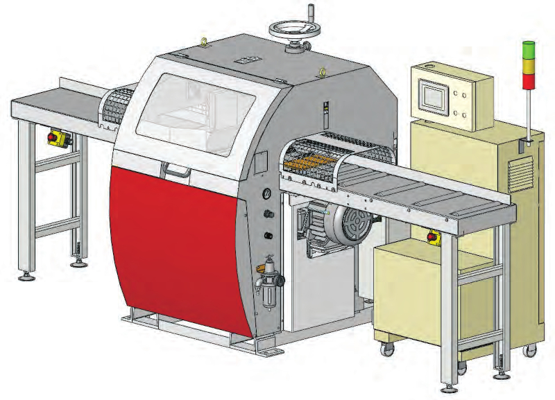

# CFS-100 Hacking Project
Howdy, hackers!

This my half-hobby half-work hacking project. The main goal of the project is
analysis of CFS-100 to secure hardware redundancy and (quite possibly) improving
the machine.

Here are the sibiling project of this project.

| Project | Description |
| - | - |
| [PegOS](https://github.com/ashegoulding/PegOS) | "Sawmilling OS". Contains the new CFS-100 HMI implementation "**MegaTrond**" |
| [fxsucc](https://github.com/ashegoulding/fxsucc) | Collection of OEM software for programming HMI and PLC |

## The Machine
The machine is called "**Semi-optimising Docking Saw**"(British?) or
"**Semi-optimising Cut-off Saw**"(US?). The model of the machine is **CFS-100**.
It looks somethings like this.

Here are catalogues from various manufacturers and distributors.

* https://www.kuangyung.com.tw/cfs-100-cut-off-saw-en
* https://titanwm.com.au/docking-saw-cfs-100/
* https://www.awmachineryllc.com/downloads/31-5045-Manual%20Reduc%20Size.pdf

The machine is (probably) originally designed by a company called "Kuang Yung"
in Taiawn. The machine is rebranded/manufactured by various distributors and
manufacturers and sold world-wide.

There are mainly two hackable components to this machine: the **PLC** and the
**HMI**. The PLC resides in the bottom compartment of the "yellow box" shown in
the picture above. The HMI(manufacturers' jargon which stands for "Human-machine
Interface") is the LCD screen that's on the top compartment of the box.

## Why Hack It?
Because it can be made beter. It's 2021 now. The PLC is from 2003[1] and the SoC
is ARM9-based. I'm more or less okay with the PLC. It does the job quite nicely.
It's the HMI that I don't really like about the machine. I'm sure I can make
something way better with modern hardware and software possibly without changing
a single line of the PLC code.

Another reason why I decided to hack it was that it's hard to procure hardware
used on the machine. I have tried contacting the manufacturers of the PLC and
the HMI. I could not hear back from either of them. That's when I realised that
it will become hard to get electronics, especially ones with software, in the
future. The companies involved in the making of the machine are not that big.
The HMI and the PLC are not readily available on the market. It's a good idea to
prepare for the event of the failure of these components before it's too late.

I have tried contacting the manufacturers of the components first to get spare
parts. They both ignored my attempt to open a dialogue. Screw that because I
don't think I need the exact same products to make the machine running. That's
what this project is all about.

## PLC
The model of the PLC is **UTSD105**([picture](doc/img/utsd-105/plc.jpg)). It has two
RS232 serial ports. The HMI controls the PLC using COM2 port. The serial
protocol is a rather simple and crude text-based protocol that uses
carriage-return newline style(aka "Mac style"). You can work out the
innerworkings of the PLC with the documentations from the manufacturer, Micro
Trend(not to be confused with the big company). They're not perfect. There are
undocumented features that appear only in the OEM software(don't use them), but
they're all you need when proramming the PLC right from scratch.

## HMI
The model of the HMI is **GT056-AST2B**([picture](doc/img/gt056-ast2b/hmi.jpg)).
It's basically an embedded device powered by an ARM-based SoC that runs a custom
made OS. When I say "custom made" here, I really mean "CUSTOM MADE". It's not
Linux or Windows as you might think. It's probably programmed like an MCU
judging by the performance and boot time. The manufacturer has made an IDE
called **Panel Master** for development of their HMIs. It's an old framework for
old hardware. My guess is that the designer of the machine had to stick with the
IDE at the time of development in 2000s.

## On Emulating GT056
It seems that the firmware image has "layers". This abstraction must be their
equivalent of mtdblocks of spiflash.

* OS0 (u-boot like bootloader?)
* OS1
* OS2 (optional?)
* OSApp

The strings in OS0 or 1 appear in ASCII. Further down the file, the strings
start to appear in UTF-16LE. This makes sense because the main users will be
Chinese speakers so it would be beneficial to use wide character encoding. So
the CPU is probably in little-endian mode as well.

There is a hope. We've got the SoC datasheet. We know the parts used for the
HMI. We can work out the rest from the binary. I took the pictures of the parts
on the PCB and saved them in [`img/gt056-ast2b`](img/gt056-ast2b). In summary,
two things need to be done.

1. Extract the contents of the mtdblocks from the .prp file
1. Make the QEMU machine, implementing devices used along the way

It's not going to be easy. For starters, writing the device for the LCD
controller is going to be a challenge. So, for the time being, I'm trying the
other option: making my own version of the HMI app. The emulation option will
take too long and the original app is crappy anyway so it'd be the best option
to make a better app running on modern hardware.

## Appendix
### Document Index
Where to go from here.

| Doc | Description |
| - | - |
| [doc/links.md](doc/links.md) | Original links to the materials obtained from Google Search |

[1]: http://www.utrend.com.tw/e-all-about.htm
